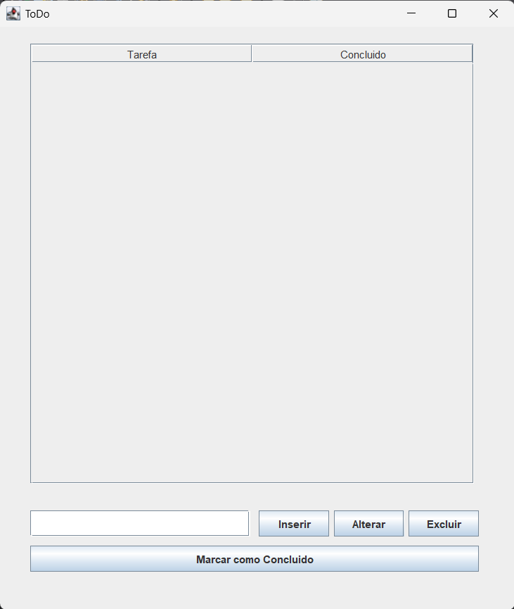

# To-Do-List-JavaX 📝

Este é um aplicativo simples de lista de tarefas (To-Do List) desenvolvido em Java, projetado para ajudar você a organizar suas tarefas diárias de forma eficiente em uma aplicação desktop.

## ✨ Funcionalidades

* **Adicionar Tarefas:** Crie novas tarefas para sua lista.
* **Marcar como Concluída:** Altere o status de uma tarefa para "concluída".
* **Remover Tarefas:** Exclua tarefas que não são mais necessárias.
* **Interface Intuitiva:** Um design limpo e fácil de usar para gerenciar suas tarefas.

## 🛠️ Tecnologias Utilizadas

* **Java**: Linguagem de programação principal.
* **Java Swing / JavaFX**: Biblioteca para a construção da interface gráfica de usuário (GUI).
* **Gson**: Biblioteca usada para o salvamento de dados em um JSON.

## 🚀 Como Executar o Projeto

Para rodar este aplicativo To-Do List em sua máquina local, siga as instruções abaixo. Você precisará ter o **JDK (Java Development Kit)** instalado.

1.  **Clone o repositório:**
    ```bash
    git clone [https://github.com/Luan-H/To-Do-List-JavaX.git](https://github.com/Luan-H/To-Do-List-JavaX.git)
    ```

2.  **Navegue até o diretório do projeto:**
    ```bash
    cd To-Do-List-JavaX
    ```

3.  **Compile o código-fonte:**
    ```bash
    javac seu/pacote/principal/MainApp.java # Substitua 'seu/pacote/principal/MainApp.java' pelo caminho e nome da sua classe principal (onde está o método `main`)
    ```

4.  **Execute o aplicativo:**
    ```bash
    java seu.pacote.principal.MainApp # Substitua 'seu.pacote.principal.MainApp' pelo caminho e nome da sua classe principal
    ```
    *Se você estiver usando uma IDE como IntelliJ IDEA, Eclipse ou NetBeans, você pode simplesmente importar o projeto e executá-lo diretamente.*

## 📸 Captura de Tela (Screenshot)



## 👨‍💻 Autor

Feito por **Luan Henrique Ribeiro de Sousa**.
